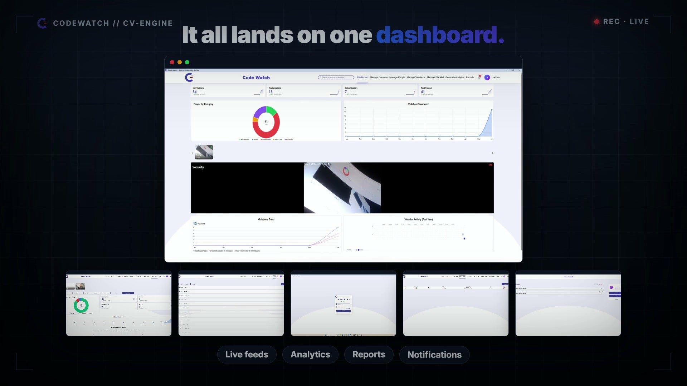
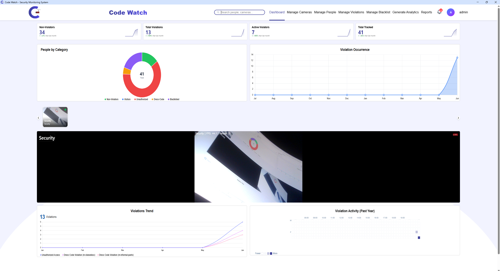
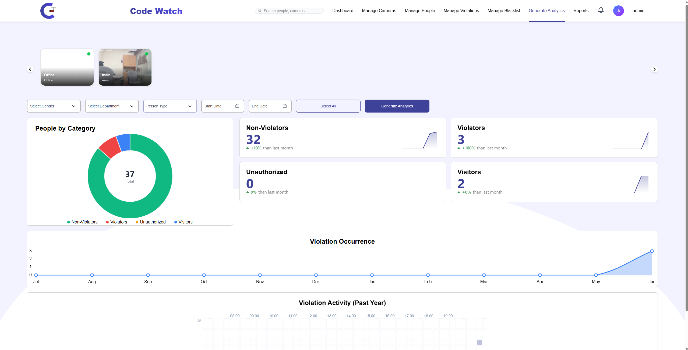
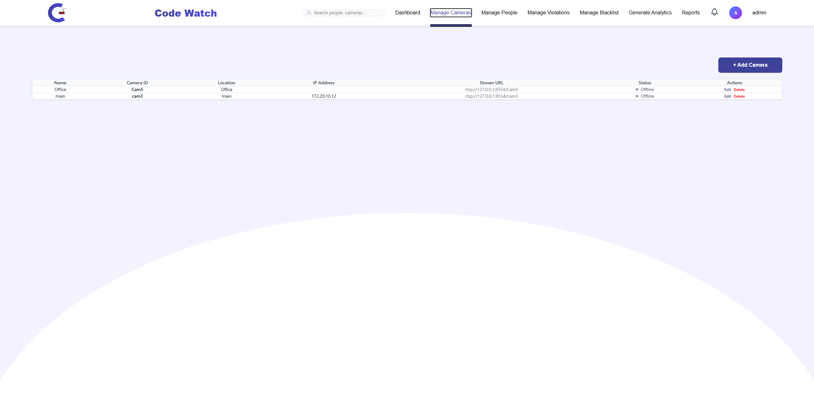
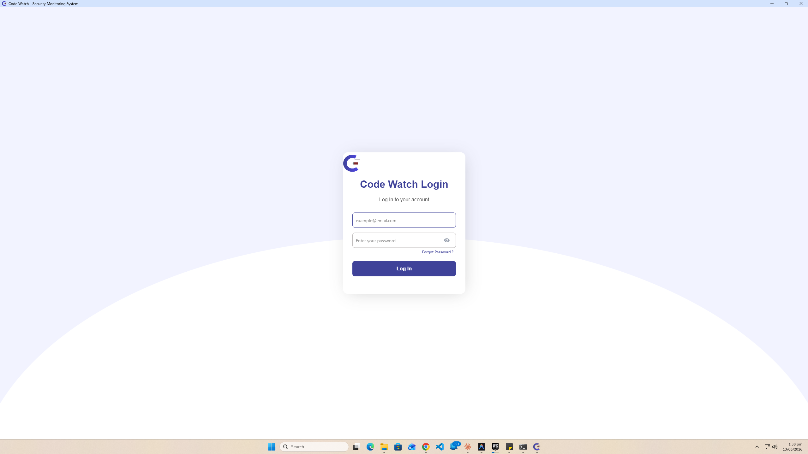

# CodeWatch

CodeWatch is a real-time, multi-camera surveillance system for a university campus. It watches
RTSP / MJPEG / webcam feeds, detects every visible person, identifies them against a face database,
verifies the face is **live** (not a photo or screen replay), checks whether their clothing complies
with a dress code, and logs any violation to a web dashboard.

Three classes of alert are raised, persisted, and pushed to the dashboard (with optional email to
the person involved):

- **Dress Code Violation**
- **Unauthorized Access** (unregistered person present)
- **Blacklisted Person Detected**

## Demo

[](Demo/CodeWatch-Launch.mp4)
<video controls width="100%">
  <source src="▶︎ **[Play the launch video](https://github.com/user-attachments/assets/b485681e-505e-44dd-8d95-0e2af28d0c22)**" type="video/mp4">
 — real-time multi-camera detection, liveness anti-spoofing, the modular CV engine, and the live dashboard.
</video>
 
### Screens

| Admin dashboard | Analytics |
|---|---|
|  |  |
| **Camera management** | **Login** |
|  |  |

## Features

- **Person detection & tracking** — YOLO instance segmentation per camera, DeepSort multi-object
  tracking with stable per-camera track IDs and motion trails.
- **Face recognition** — InsightFace `buffalo_l` 512-d embeddings, vectorised cosine matching against
  a registry, with cross-camera identity handover via Redis.
- **Liveness / anti-spoofing (PAD)** — a MiniFASNet gate that rejects printed photos, phone/tablet
  screens, and video replays before a match is trusted. See [`BackEnd/liveness/README.md`](BackEnd/liveness/README.md).
- **Dress-code compliance** — a custom-trained detector classifying male/female formal and informal
  garments, with gender inferred from detected labels.
- **Auto-registration of unknowns** — new faces are auto-enrolled after a few seconds of presence;
  repeat offenders are auto-blacklisted after a violation threshold.
- **Web dashboard** — React UI with live feeds, people management, cameras, analytics, reports,
  notifications, and per-person live tracking.

## Architecture

```
┌──────────────┐     HTTP/REST      ┌──────────────────┐     reads      ┌─────────────┐
│  React +     │ ◄────────────────► │  Django REST API │ ◄────────────► │ PostgreSQL  │
│  Vite (UI)   │                    │  (CodeWatch)     │                │ (+ pgvector)│
└──────────────┘                    └──────────────────┘                └─────────────┘
       ▲                                     ▲
       │ polls live_feed_*.jpg               │ REST + Redis
       │                                     │
┌──────────────────────────────────────────────────────────┐
│  CV engine (FinalSystem)                                  │
│  YOLO → DeepSort → InsightFace → Liveness → Dress code    │
│  one CameraThread per active camera, shared Redis state   │
└──────────────────────────────────────────────────────────┘
```

The CV engine annotates frames to `FrontEnd/public/live_feed_{camera_id}.jpg`, which the dashboard
polls — no WebSocket or browser-side RTSP. Redis carries cross-camera identity handover, live-track
highlighting, and rate-limiting state.

## Tech stack

| Layer       | Technologies |
|-------------|--------------|
| Frontend    | React 19, Vite, Tailwind CSS, Recharts / Chart.js, Axios |
| Backend API | Django 5, Django REST Framework, PostgreSQL (pgvector), Redis |
| CV engine   | PyTorch (CUDA), Ultralytics YOLO, InsightFace, DeepSort, MiniFASNet, OpenCV |
| Streaming   | MediaMTX (RTSP/MJPEG ingest) |

## Repository layout

```
BackEnd/        Django project (CodeWatch), REST API, CV engine (FinalSystem), liveness module
FrontEnd/       React + Vite dashboard
```

## Prerequisites

- Python 3.11+ with a CUDA-capable GPU (CPU works but is slow)
- Node.js 18+
- PostgreSQL (with the `pgvector` extension)
- Redis
- One or more cameras (webcam, or RTSP/MJPEG IP cameras)

## Setup

### 1. Backend

```bash
cd BackEnd
python -m venv venv
venv\Scripts\activate            # Windows
# source venv/bin/activate        # macOS/Linux
pip install -r requirements.txt
```

Copy `BackEnd/.env.example` to `BackEnd/.env` and fill in your values:

```
DJANGO_SECRET_KEY=your-django-secret-key
DB_NAME=codewatch
DB_USER=postgres
DB_PASSWORD=your-database-password
DB_HOST=localhost
DB_PORT=5432
```

Run migrations and create an admin user:

```bash
python manage.py migrate
python manage.py createsuperuser
python manage.py runserver
```

### 2. Frontend

```bash
cd FrontEnd
npm install
npm run dev
```

### 3. CV engine

With the API running and at least one active camera configured:

```bash
cd BackEnd
venv\Scripts\python FinalSystem.py
```

## API overview

The API is rooted at `/api/`. Representative endpoints:

| Method | Endpoint | Purpose |
|--------|----------|---------|
| GET  | `/api/get-embeddings/`   | All persons with their embedding vectors (consumed by the CV engine) |
| GET  | `/api/cameras/`          | Active camera configs |
| POST | `/api/log-violation/`    | Log a violation (with daily per-category dedup) |
| POST | `/api/movement-log/`     | Record person enter/exit events |
| POST | `/api/register-unknown/` | Auto-register a new unknown face |
| POST | `/api/camera-heartbeat/` | Update camera online status |

See [`BackEnd/CodeWatch/urls.py`](BackEnd/CodeWatch/urls.py) for the full route list.

## Configuration

Tunable CV thresholds (detection confidence, face-match similarity, liveness voting, violation
cooldowns, etc.) live in the `PARAMS` dict at the top of `BackEnd/FinalSystem.py`. Liveness-specific
options are documented in [`BackEnd/liveness/README.md`](BackEnd/liveness/README.md).
